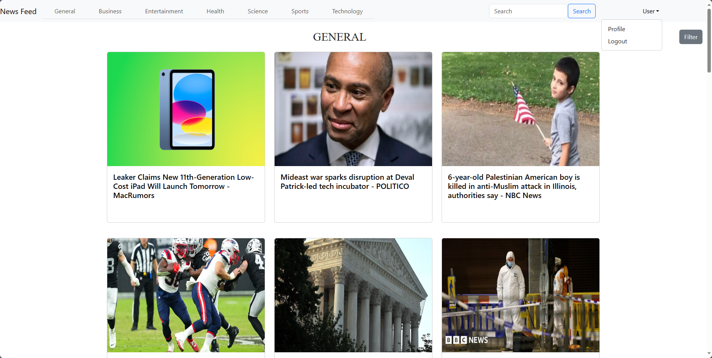
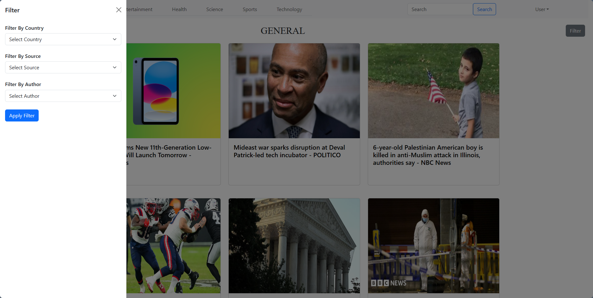
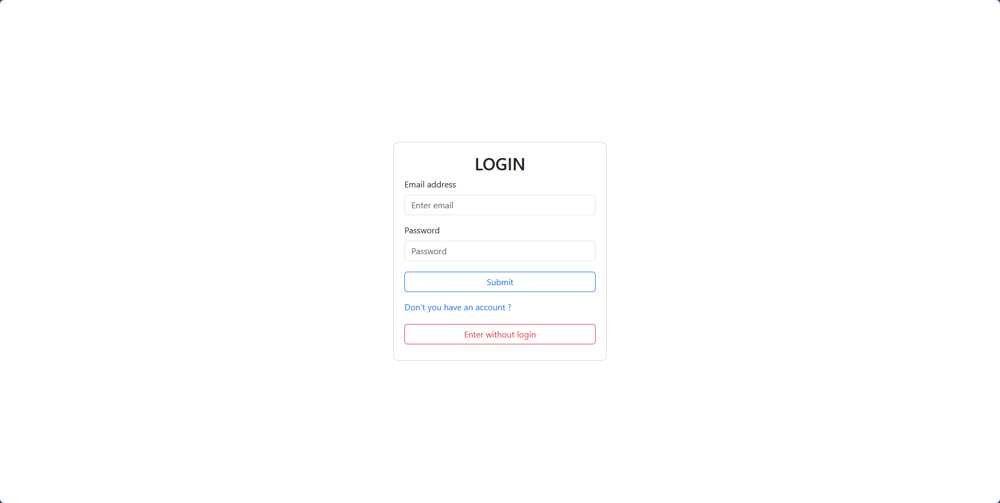
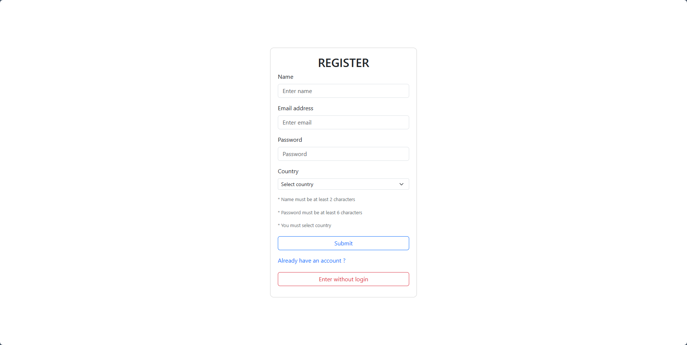
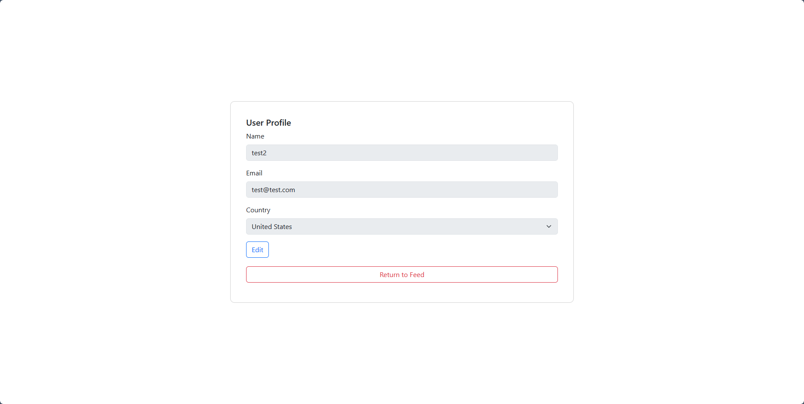

<h3 align="center">News Feed</h3>

---

<p align="center"> Personalized News Feed System
    <br> 
</p>

## 📝 Table of Contents

- [About](#about)
- [Getting Started](#getting_started)
- [Usage](#usage)
- [Built Using](#built_using)
- [Acknowledgments](#acknowledgement)
- [Images](#images)

## 🧐 About <a name = "about"></a>

This is a personalized news feed system. It offers news from many countries and many sources to the user according to their preferences.

## 🏁 Getting Started <a name = "getting_started"></a>

These instructions will get you a copy of the project up and running on your local machine for development and testing purposes. See [deployment](#deployment) for notes on how to deploy the project on a live system.

### Prerequisites

```
Node.js
```

### Installing

Clone the repository

```
www.
```

Open terminal

```
...\GitHub\News-Feed> npm install
```

Open another terminal and first reach the client directory

```
...\GitHub\News-Feed> cd client
```

Then npm install

```
...\GitHub\News-Feed\client> npm install
```

## 🎈 Usage <a name="usage"></a>

- User can use with registration or without it.
- News will be based on the country selected by the user.(If Registered)
- User can select category on top.
- User can filter results by country, source or author
- User can search articles by keyword
- User can change personal information and country on account page

## ⛏️ Built Using  <a name="built_using"></a>

- [NodeJs](https://nodejs.org/en/) - Server Environment
- [Express](https://expressjs.com/) - Server Framework
- [Reactjs](https://react.dev/) - Web Framework
- [MongoDB](https://www.mongodb.com/) - Database

## 🎉 Acknowledgements  <a name="acknowledgement"></a>

- The source or author may not be available in every country.
- The daily limit of APIs used for news is 50.
- Some of the news may not include images.

## 🎉 Images  <a name="images"></a>
 
 
 
 
 

```
